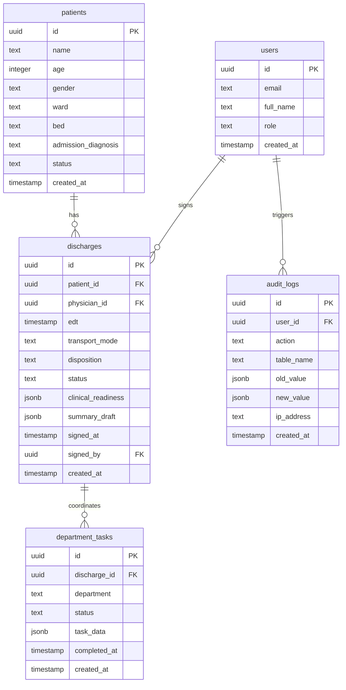

# Implementation Plan — Qdischarge Full-Stack Platform

Qdischarge is an AI-assisted discharge summary automation and multi-department coordination platform designed to address critical clinical documentation inefficiencies in Indian healthcare. It aligns with NABH Standard COP.9, ABDM/NHCX claims exchange requirements, and HL7 FHIR R4 interoperability guidelines to streamline patient discharge, reduce administrative burden, and eliminate billing/insurance friction.

This plan details the full-stack implementation of Qdischarge using Next.js 15, TypeScript, Tailwind CSS, Supabase, and Vercel.

---

## User Review Required

Please review the proposed architecture, database schema, and verification steps. 

> [!IMPORTANT]
> **Key Architectural Decisions:**
> 1. **Project Initialization:** The project will be initialized in the workspace root (`d:\Github repository\Qdischarge-with-Antigravity`) using Next.js 15.
> 2. **Authentication Flow:** Using Supabase Auth (Email/Password & optional Google OAuth) integrated with Next.js middleware to protect `/dashboard/**` routes and refresh active sessions automatically.
> 3. **Role-Based Access Control (RBAC):** Users are assigned clinical/administrative roles (Physician, Pharmacist, Nurse, Billing, Care Coordinator, Bed Manager). Each role has a customized view of the multi-department dashboard.
> 4. **Completeness Gate & Locking:** Implementing strict documentation checks where the Physician cannot final-sign the summary unless all NABH-mandated fields are present. Once signed, the summary is immutable (append-only addendum pattern).

Please let me know if you would like any modifications to this database structure or the workflow transitions before I proceed with execution.

---

## Proposed Changes

We will generate a modern, premium full-stack application structured as follows:

```
/
├── AGENT.md                         ← Memory & directives
├── next.config.ts                   ← Next.js configurations
├── tailwind.config.ts               ← Tailwind CSS v4 styling
├── tsconfig.json                    ← Strict TypeScript compiler settings
├── vercel.json                      ← Production vercel configurations
├── .env.local.example               ← Template env file
├── middleware.ts                    ← Authentication route protection & session refresh
│
├── app/
│   ├── layout.tsx                   ← Root layouts with React-Query + Zustand providers
│   ├── page.tsx                     ← Highly aesthetic landing & marketing page
│   ├── (auth)/
│   │   ├── login/page.tsx           ← Modern login component (credentials & OAuth)
│   │   └── signup/page.tsx          ← User signup with role-based registration
│   ├── (protected)/
│   │   └── dashboard/
│   │       ├── page.tsx             ← Live Patient List & phase monitoring
│   │       ├── patient/[id]/page.tsx ← Multi-phase clinical workflow dashboard
│   │       └── analytics/page.tsx   ← Weekly metrics & department TAT heatmaps
│   └── api/
│       ├── auth/callback/route.ts   ← Supabase OAuth exchange endpoint
│       └── [dynamic API routes]     ← Typed Zod validated API endpoints
│
├── components/
│   ├── ui/                          ← Premium shadcn/ui custom components
│   ├── auth/
│   │   ├── LoginForm.tsx
│   │   └── SignupForm.tsx
│   ├── dashboard/
│   │   ├── PatientCard.tsx          ← Summary card for ward/bed
│   │   ├── PhaseProgress.tsx        ← Step tracker (Phases 1-6)
│   │   ├── LiveDeptStatus.tsx       ← Sidebar real-time department tracker
│   │   └── DepartmentDashboard.tsx  ← Role-specific view overlays
│   └── workflow/
│       ├── Phase1Initiation.tsx     ← Discharge order entry & EDT logging
│       ├── Phase2SummaryEditor.tsx  ← AI Summary preview & inline edits (NABH check)
│       ├── Phase3Coordination.tsx   ← Interactive status monitor & overrides
│       ├── Phase4AuditTrail.tsx     ← Enforced immutable compliance table view
│       ├── Phase5Notification.tsx   ← Patient notification dispatch dashboard
│       └── Phase6Analytics.tsx      ← Real-time throughput metrics & charts
│
├── lib/
│   ├── supabase/
│   │   ├── client.ts                ← Browser Supabase client hook
│   │   └── server.ts                ← Server Supabase SSR client helper
│   ├── validations/                 ← Zod validation schemas
│   └── utils.ts                     ← Tailblock class merger utility
│
├── hooks/
│   └── useUser.ts                   ← User state & session manager
│
├── types/
│   └── database.types.ts            ← Database types
│
└── supabase/
    └── migrations/
        └── 0001_init.sql            ← Initial schemas & RLS policies
```

---

### Database Schema Design (`/supabase/migrations/0001_init.sql`)

The database is built on PostgreSQL with Row Level Security (RLS) enabled for all tables, referencing `auth.uid() = user_id`.



1. **`users` (Profiles)**: Extends Supabase `auth.users`. Roles include `physician`, `pharmacist`, `nurse`, `billing`, `care_coordinator`, `bed_manager`.
2. **`patients`**: Tracks demographic information and bed assignment in the hospital.
3. **`discharges`**: Core table. Tracks active discharge states, AI summary drafts, signatures, and estimated discharge times.
4. **`department_tasks`**: Real-time progress tracker. Triggers specific updates when pharmacy, nursing, billing, care coordination, or housekeeping completes their task.
5. **`audit_logs`**: Tamper-proof logs representing append-only database operations for medical audit trails.

---

### Phase-by-Phase Platform Workflow

We will implement the mock layout shown in `qdischarge-physician-workflow.html` with a premium reactive dashboard:

#### Phase 1: Discharge Initiation
- Form to log discharge order, disposition, transport mode, and mandatory Estimated Discharge Time (EDT).
- On confirm, auto-generates entries in `department_tasks` for Pharmacy, Nursing, Billing, Care Coordination, Bed Management.

#### Phase 2: AI Summary Editor
- Fetches initial patient chart data and auto-drafts the discharge summary (Hospital Course, Medications, Lab Trends, Follow-up).
- Renders an interactive document preview allowing inline edits.
- Integrates a checklist validating standard clinical benchmarks before enabling the "Digital Signature" lock button.

#### Phase 3: Live Multi-Department Status
- Multi-column view representing live feedback from Pharmacy (Medication Reconciliation), Nursing (Discharge Vitals & IV Removal), Billing (Insurance Claim Validation), Bed Management (Housekeeping Clean Signal).
- Supports simulated override clicks for manual task completions.

#### Phase 4: Compliance Audits
- An append-only historical database view displaying the immutable record ledger.
- Clearly displays ABDM and JCI conformance checks.

#### Phase 5: Patient Notification Center
- Dispatch logs sending SMS, WhatsApp, and patient portal summaries.
- Shows final patient discharge slip layout for printing.

#### Phase 6: Throughput Analytics
- Charts capturing Turnaround Time (TAT), discharge volume trends, and department bottlenecks.

---

## Verification Plan

### Automated Tests
1. **Schema Check**: Apply schema migrations and verify standard indexing, constraint checks, and triggers are loaded.
2. **Linter Check**: Execute `npm run lint` and `npm run build` to verify proper TypeScript types and NextJS output compilation.

### Manual Verification
1. **Interactive Demo**: Run the application locally with `npm run dev` to demonstrate the active interactive dashboards, simulating Phase 1 order placement, Phase 2 content overrides, Phase 3 mock clearance updates, and Phase 6 metrics.
2. **Role Switching**: Validate role views representing custom permissions for clinicians, pharmacists, and nurses.
